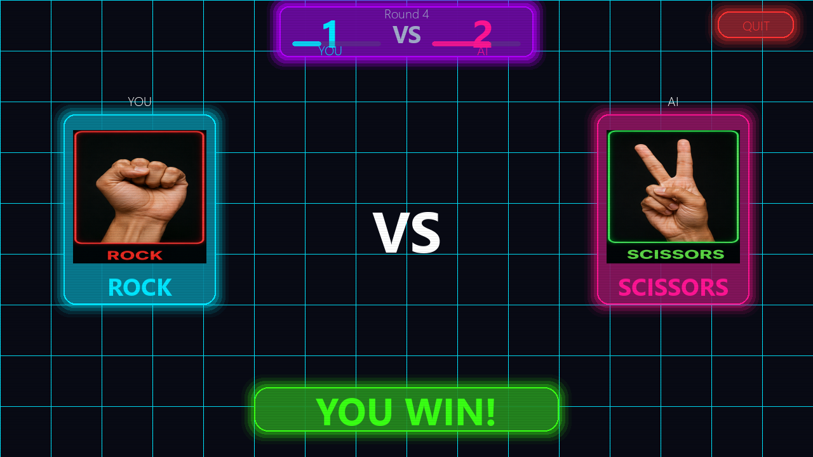
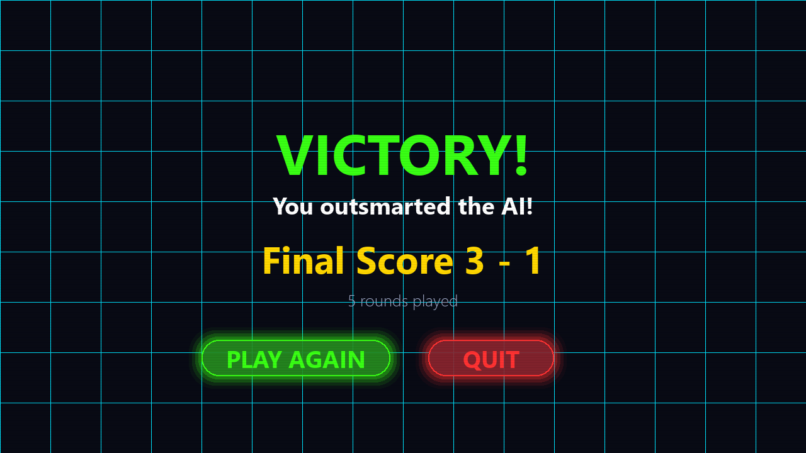

# Rock Paper Scissors AI ✊📄✂️

A real-time AI-powered Rock Paper Scissors game built with **Python, OpenCV, MediaPipe, and Pygame**.

The game uses your webcam to detect hand gestures and lets you play Rock Paper Scissors against an adaptive AI opponent with animated neon UI, sound effects, score tracking, and particle effects.

---

## 🚀 Features

* Real-time webcam-based hand gesture detection
* Rock, Paper, and Scissors recognition using MediaPipe
* AI opponent with basic adaptive prediction logic
* Neon-style animated game interface
* Countdown before each round
* Scoreboard and round tracking
* Sound effects for win, lose, draw, and start
* Background music support
* Particle burst animations
* Game-over screen with replay option
* Assets-based design with custom images and audio

---

## 🛠️ Tech Stack

* **Python**
* **OpenCV**
* **MediaPipe**
* **Pygame**
* **NumPy**

---

## 📁 Project Structure

```bash
Rock-Paper-Scissors-AI/
│
├── assets/
│   ├── bg_music.mp3
│   ├── draw.wav
│   ├── lose.wav
│   ├── paper.png
│   ├── rock.png
│   ├── scissors.png
│   ├── start.wav
│   └── win.wav
│
├── hand_landmarker.task
├── main.py
├── requirements.txt
├── stats.json
├── README.md
└── .gitignore
```

---

## 🎮 How to Play

1. Run the game.
2. Press **SPACE** to start.
3. Show your hand gesture in front of the webcam.
4. The AI will choose its move.
5. The winner is decided automatically.
6. First player to reach the winning score wins the match.

---

## ✋ Gesture Rules

| Gesture                    | Meaning  |
| -------------------------- | -------- |
| Closed fist                | Rock     |
| Open palm                  | Paper    |
| Index + Middle finger open | Scissors |

---

## ⌨️ Controls

| Key         | Action                                |
| ----------- | ------------------------------------- |
| SPACE       | Start game                            |
| ESC         | Exit game                             |
| Mouse Click | Play again / Quit on game-over screen |

---

## ⚙️ Installation

### 1. Clone the repository

```bash
git clone https://github.com/GautamSharma-DS/Rock-Paper-Scissors-AI.git
cd Rock-Paper-Scissors-AI
```

### 2. Create virtual environment

```bash
py -3.11 -m venv venv
```

### 3. Activate virtual environment

```bash
venv\Scripts\Activate.ps1
```

### 4. Install dependencies

```bash
pip install -r requirements.txt
```

### 5. Run the project

```bash
python main.py
```

---

## ⚠️ Important Note

This project works best with **Python 3.11**.

MediaPipe may not work properly with newer Python versions like Python 3.13 or Python 3.14.

Recommended setup:

```bash
Python 3.11
mediapipe==0.10.14
pygame
opencv-python
numpy
```

---

## 🧠 AI Logic

The AI mostly selects a random move, but after a few rounds it starts checking the player's previous moves and tries to counter the most repeated gesture.

Example:

* If the player often chooses Rock, AI may choose Paper.
* If the player often chooses Paper, AI may choose Scissors.
* If the player often chooses Scissors, AI may choose Rock.

---

## 📌 Main Concepts Used

* Computer Vision
* Hand Landmark Detection
* Gesture Classification
* Game State Management
* Event Handling
* Real-time Webcam Processing
* Pygame UI Rendering
* Sound and Music Integration
* Basic AI Prediction Logic

---

## 📸 Screenshots

### Main Menu

The futuristic neon-themed main menu with animated UI, glowing effects, and game previews.


---

### Gameplay

Real-time hand gesture detection powered by MediaPipe and OpenCV.



---

### Victory Screen

Match result screen with score summary and replay options.



---

## 🔮 Future Improvements

* Better gesture accuracy
* Difficulty levels
* Player name input
* Match history
* Save high scores
* Better AI strategy
* More advanced UI animations
* Multiplayer mode
* Streamlit or web version

---

## 👨‍💻 Author

**Gautam Sharma**

Python and Data Science learner building practical AI and computer vision projects.

---

## ⭐ Support

If you like this project, give it a star on GitHub.

